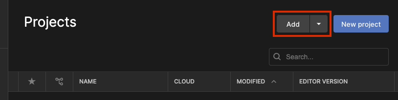
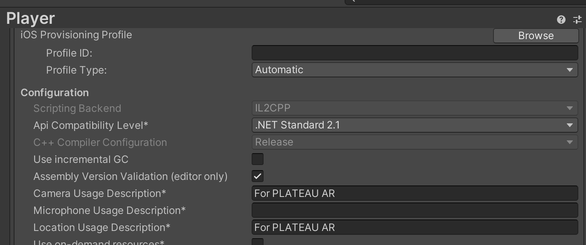

# PLATEAU SDK-AR-Extensions for Unity テンプレートプロジェクト利用マニュアル

このテンプレートプロジェクトは PLATEAU 3D都市モデルを利用したARアプリケーション開発用の Unity プロジェクトのテンプレートです。このテンプレートプロジェクトはARアプリケーション開発に必要なパッケージのインストールや設定が完了しているため、アプリケーションのビルドなどを簡単に行うことができます。
     
### 更新履歴
| 更新日時 | 更新内容 |
| :--- | :--- |
|  2024/1/15  | 初版リリース |

     
# 目次

<!-- @import "[TOC]" {cmd="toc" depthFrom=1 depthTo=6 orderedList=false} -->

<!-- code_chunk_output -->

- [PLATEAU SDK-AR-Extensions for Unity テンプレートプロジェクト利用マニュアル](#plateau-sdk-ar-extensions-for-unity-テンプレートプロジェクト利用マニュアル)
    - [更新履歴](#更新履歴)
- [目次](#目次)
- [このテンプレートについて](#このテンプレートについて)
  - [検証済環境](#検証済環境)
    - [OS環境](#os環境)
  - [バージョン情報](#バージョン情報)
    - [Unity バージョン](#unity-バージョン)
    - [レンダリングパイプライン](#レンダリングパイプライン)
    - [PLATEAU SDK バージョン](#plateau-sdk-バージョン)
- [ARビルド用の設定について](#arビルド用の設定について)
- [利用手順](#利用手順)
  - [1. テンプレートプロジェクトをコピーしてAR開発用プロジェクトを作成する](#1-テンプレートプロジェクトをコピーしてar開発用プロジェクトを作成する)
    - [1-1. Unity プロジェクトの作成](#1-1-unity-プロジェクトの作成)
    - [1-2. Google Cloud ARCore API の認証設定](#1-2-google-cloud-arcore-api-の認証設定)
    - [1-3. (iOSの場合のみ) カメラ等の許可設定](#1-3-iosの場合のみ-カメラ等の許可設定)
- [ライセンス](#ライセンス)
- [注意事項/利用規約](#注意事項利用規約)

<!-- /code_chunk_output -->

# このテンプレートについて

## 検証済環境
### OS環境
- Windows11
- macOS Ventura 13.2
- Android 13
- iOS 16.7.1

## バージョン情報

### Unity バージョン
- Unity 2021.3.31f1 (2023/10/10現在 2021 LTSバージョン)
    - Unity 2021.3系であれば問題なく動作する見込みです。

### レンダリングパイプライン
- URP (Universal Rendering Pipeline)

> [!Warning]
> HDRP (High Definition Rednering Pipeline) および Built-in Rendering Pipeline では動作しません。

### PLATEAU SDK バージョン
- [PLATEAU SDK v2.2.1-alpha](https://github.com/Synesthesias/PLATEAU-SDK-for-Unity/releases/tag/v2.0.3-alpha)

# ARビルド用の設定について

このテンプレートプロジェクトでは以下の設定をすでに完了しています。既存のプロジェクトなどにAR設定を行う場合などは以下を参考にしてください。

- **ARおよびPLATEAUに関するパッケージの追加 (Packages/manifest.json)**
    - PLATEAU SDK for Unity (Git URL)
    - PLATEAU SDK-Toolkits for Unity (Git URL)
    - PLATEAU SDK-Maps-Toolkit for Unity (Git URL)
    - PLATEAU SDK-AR-Extensions for Unity (Git URL)
    - Cesium for Unity (OpenUPM)
    - ARCore Extensions (Git URL)
        - Unity の AR関連パッケージはこのパッケージの依存としてインストールされます。
- **ARCore Extensions の 設定**
    - Geospatial API の有効化
    - iOS ビルドの有効化
- **XR Plug-in Management の設定**
    - Android
        - ARCore の有効化
    - iOS
        - ARkit の有効化
- **ビルド設定**
    - コンパイラーをIL2CPPに変更
    - Graphics APIをOpenGL ES3に変更

# 利用手順

## 1. テンプレートプロジェクトをコピーしてAR開発用プロジェクトを作成する

### 1-1. Unity プロジェクトの作成

1. 本ディレクトリを任意の作業ディレクトリにコピーします。
2. コピーしたディレクトリの名前を任意のプロジェクト名に変更してください（Unityではプロジェクトのディレクトリ名がプロジェクト名として認識されます）。
3. Unity Hub を開き、上部の "Add" を押下し、作成した Unity プロジェクトのディレクトリを選択してください。

4. アセットのインポート等が完了すると Unity エディタが開きます。
5. AR開発ではiOSもしくはAndroidで動作するアプリケーションをビルドするため、 "File" > "Build Settings..." からビルド設定を開き、アプリケーションを利用するプラットフォームに合わせてプラットフォームを変更してください。
    - プラットフォームを切り替えるためには対象のバージョンの Unity エディタに各プラットフォームのモジュールを追加してください。
        - [プラットフォームの追加を含むビルド設定のマニュアル](https://docs.unity3d.com/ja/current/Manual/BuildSettings.html)

### 1-2. Google Cloud ARCore API の認証設定

本テンプレートのAR実装は Google Cloud ARCore API (ARCore Geospatial API) を使用しています。認証キーは原則プロジェクトごとに発行する必要があり、テンプレートには設定されていません。そのため、ARCore API を使用するための認証キーを Unity プロジェクトに設定する必要があります。

以下の利用ガイドを参考に任意の認証方法で ARCore API を設定してください。

**Unity 向け ARCore API の利用ガイド**
https://developers.google.com/ar/develop/unity-arf/geospatial/enable-android?hl=ja

### 1-3. (iOSの場合のみ) カメラ等の許可設定

iOS ではカメラなどの端末機能を使用する場合にビルド設定に利用用途を記載する必要があります。本テンプレートでは仮の利用用途として「For PLATEAU AR」と記載していますが、アプリケーションを開発される際は各自利用用途を記載してください。

**設定方法**
1. "File" > "Build Settings..." からビルド設定を開き、ウィンドウ左下の "Player Settings..." を押下してください。
2. "Other Settings" の "Configuration" の項目にある、 "Camera Usage Description" および "Location Usage Description" が対象の設定です。

# ライセンス
- 本リポジトリはMITライセンスで提供されています。
- 本システムの開発はユニティ・テクノロジーズ・ジャパン株式会社が行っています。
- ソースコードおよび関連ドキュメントの著作権は国土交通省に帰属します。

# 注意事項/利用規約
- 本ツールはベータバージョンです。バグ、動作不安定、予期せぬ挙動等が発生する可能性があり、動作保証はできかねますのでご了承ください。
- 本ツールをアンインストールした場合、本ツールの機能で作成されたアセットの動作に不備が発生する可能性があります。
- 本ツールをアップデートした際は、一度 Unity エディターを再起動することを推奨しています。
- パフォーマンスの観点から、3km²の範囲に収まる3D都市モデルをダウンロード・インポートすることを推奨しています。
- インポートする範囲の広さや地物の種類（建物、道路、災害リスクなど）が量に比例して処理負荷が高くなる可能性があります。
- 本リポジトリの内容は予告なく変更・削除される可能性があります。
- 本リポジトリの利用により生じた損失及び損害等について、国土交通省はいかなる責任も負わないものとします。
